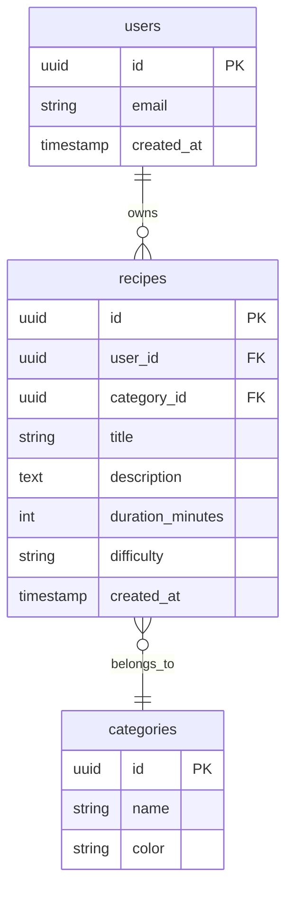

# Petite Cuillère 🥄

## Description
**Petite Cuillère** est une application web de type *cookbook* permettant de gérer ses recettes personnelles.
Elle propose une authentification via Supabase, un CRUD complet sur les recettes, ainsi qu’un système de recherche, filtres, tri et pagination pour retrouver facilement ses plats.
L’interface est pensée pour être claire, responsive et accessible.

## Fonctionnalités
- [x] Authentification (Supabase Auth)
  - [x] Inscription email / mot de passe
  - [x] Connexion
  - [x] Déconnexion
  - [x] Persistance de session
  - [x] Protection des routes (pages privées)
  - [x] OAuth (Google + GitHub)
- [x] CRUD complet sur la ressource principale : **recipes**
  - [x] Create : ajout d’une recette
  - [x] Read : liste + page détail
  - [x] Update : modification d’une recette
  - [x] Delete : suppression d’une recette
- [x] Recherche + filtrage + tri
  - [x] Recherche textuelle
  - [x] Filtres (régime, temps, technique de cuisson, difficulté)
  - [x] Tri (date, alphabétique)
  - [x] Pagination
- [x] UI/UX
  - [x] États de chargement, erreurs, messages de succès
  - [x] Empty states (liste vide, aucun résultat)
  - [x] Responsive (mobile + desktop)
- [x] Page 404
- [x] Tests unitaires (Vitest + Testing Library)

## Stack technique
- React 18
- TypeScript
- Vite
- React Router v6
- Supabase (Auth + Database)
- CSS Modules
- Vitest + React Testing Library
- Context API (state management)

## Installation

### Prérequis
- Node.js 18+
- npm ou yarn
- Un projet Supabase (URL + Anon Key)

### Lancement en local
1. Cloner le projet :
   ```bash
   git clone <URL_DU_REPO>
   cd petite-cuillere
   ```
2. Installer les dépendances
   ```bash
   npm install
   ```
3. Créer un fichier .env.local à la racine du projet
   ```bash
   VITE_SUPABASE_URL=your_supabase_url
   VITE_SUPABASE_ANON_KEY=your_supabase_anon_key
   ```
4. Lancer l'application
   ```bash
   npm run dev
   ```
5. Lancer les tests
   ```bash
   npx vitest --ui
   ```

## Structure du projet
```bash
src/
  App.css
  App.tsx
  index.css
  main.tsx
  setupTests.ts
  supabase.ts
  assets/
  components/
    auth/
      Login/
        LoginForm.tsx
        LoginForm.test.tsx
      RequireAuth/
        RequireAuth.tsx
        RequireAuth.test.tsx
      SignUp/
        SignupForm.tsx
        SignupForm.test.tsx
    layout/
      Navbar.tsx
      Navbar.module.css
      Navbar.test.tsx
    recipes/
      Filters/
        Filters.tsx
        Filters.test.tsx
      Pagination/
        Pagination.tsx
        Pagination.test.tsx
      RecipeCard/
        RecipeCard.tsx
        RecipeCard.test.tsx
      RecipeForm/
        RecipeForm.tsx
        RecipeForm.test.tsx
      RecipeList/
        RecipesList.tsx
        RecipesList.test.tsx
      SearchBar/
        searchBar.tsx
        SearchBar.test.tsx
  contexts/
    AuthContext.tsx
  pages/
    AuthPage/
      AuthPage.tsx
      AuthPage.module.css
      AuthPage.test.tsx
    NotFoundPage/
      NotFoundPage.tsx
      NotFoundPage.module.css
      NotFoundPage.test.tsx
    RecipesDetailsPage/
      RecipesDetails.tsx
      RecipesDetails.module.css
      RecipesDetails.test.tsx
    RecipesPage/
      RecipesPage.tsx
      RecipesPage.module.css
      RecipesPage.test.tsx
  routes/
    AppRouter.tsx
  services/
    authService.tsx
    recipesService.tsx
  types/
    categories.ts
    recipes.ts
```

### Explications rapides
- `components/` : UI réutilisable (auth, navbar, recettes : filtres, pagination, cartes, formulaires, liste, search bar).
- `pages/` : vues principales (auth, liste, détail, 404).
- `contexts/` : state management via Context API (`AuthContext`).
- `routes/` : configuration des routes (`AppRouter`).
- `services/` : accès aux données Supabase (`authService.tsx`, `recipesService.tsx`).
- `types/` : types TypeScript (Recipe, Category, etc.).

## Guide de démo
1. Connexion/Inscription : créer un compte, se connecter; vérifier persistance après rechargement.
2. Liste des recettes : afficher la liste, observer les empty states si aucune recette.
3. Recherche/Filtrage/Tri : saisir une requête, appliquer ≥2 filtres (ex. catégorie + durée), activer tri (alphabétique/date).
4. Détail : ouvrir une recette depuis la liste, vérifier les champs.
5. Création/Édition : via `RecipeForm`, validation côté client; vérifier mise à jour de la liste.
6. Suppression : supprimer une recette avec confirmation; vérifier rafraîchissement.
7. Déconnexion : via `Navbar`; routes privées inaccessibles.
8. 404 : tester une route inconnue.

## Base de données & RLS
- Tables : `users` (Supabase Auth), `recipes` (liée à `user_id`), `categories`.
- Politiques RLS : configurées côté Supabase et **testées OK** — les utilisateurs ne voient que **leurs propres données**; données publiques limitées si applicable.
- Variables d’environnement requises : `VITE_SUPABASE_URL`, `VITE_SUPABASE_ANON_KEY`.

### Schéma (Mermaid)


### RLS détaillées (extraits)
- `recipes`: 
  - SELECT: lecture publique
  - INSERT: `user_id = auth.uid()` (CHECK)
  - UPDATE: `user_id = auth.uid()` (USING + CHECK)
  - DELETE: `user_id = auth.uid()`
- `categories`: lecture publique et écriture réservée à l’utilisateur propriétaire.

## Déploiement
- URL de production: `https://petite-cuillere.vercel.app`
- Vercel/Netlify (exemple):
  - Variables d’env: `VITE_SUPABASE_URL`, `VITE_SUPABASE_ANON_KEY`
  - Build command: `npm run build`
  - Output directory: `dist`
  - Node version: `>=18`

### Scripts
- `npm run dev` : lance Vite en développement
- `npm run build` : build de production (TypeScript + Vite)
- `npm run preview` : preview local du build
- `npm run test` : lance Vitest en mode CLI

## Tests
- Outils: Vitest + Testing Library + jsdom.
- Couverture: composants d’auth, navbar, recettes (liste, filtre, pagination, carte, formulaire), pages clés.
- Lancer en UI: `npx vitest --ui`.
- Lancer en CLI: `npm run test`.

## Accessibilité
- Navigation clavier et focus visibles à assurer sur les parcours critiques.
- Utilisation de labels et attributs ARIA sur formulaires.
- Contrastes suffisants via CSS Modules.

## Autrices
Jihad DOUHI — jihad.douhipro@gmail.com & Elisa LENOTRE - elisalenotre6@gmail.com


